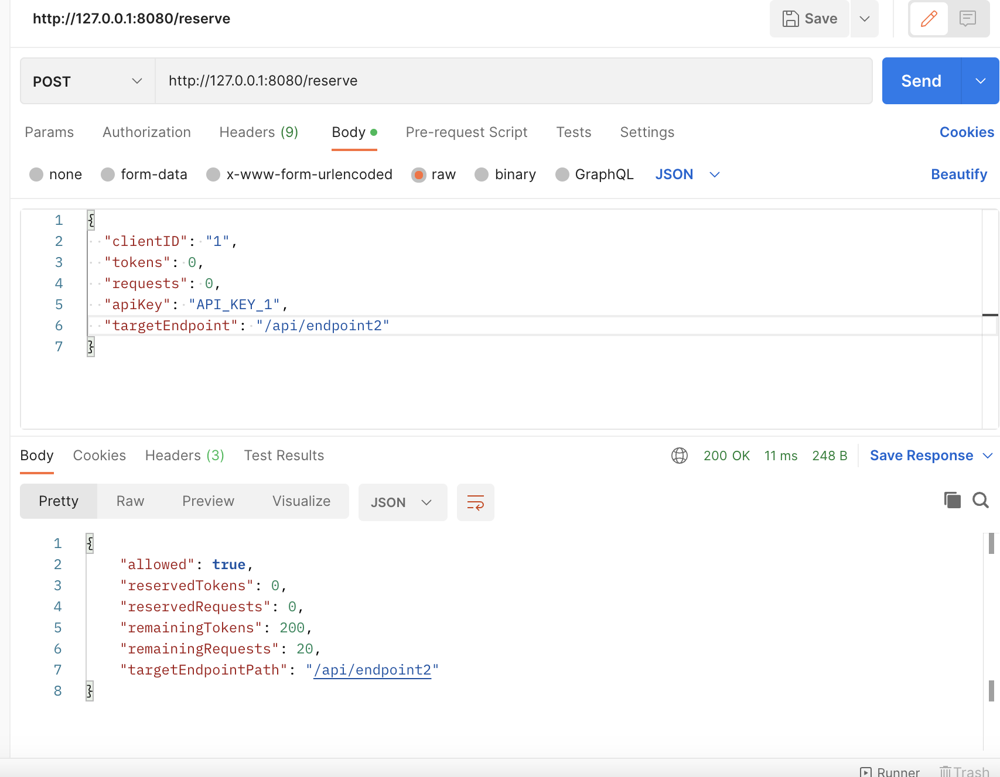

# Dynamic Distributed Rate Limiting System



## Overview
A high-performance, distributed rate limiting system implemented in Go. This system provides flexible and configurable API rate limiting capabilities with support for multiple API keys, endpoints, and priority-based request processing. It's designed to handle high-concurrency scenarios while maintaining accurate rate limiting across distributed systems.

## Key Features
- **Dynamic Rate Limiting**
  - Requests per minute (RPM) limiting
  - Tokens per minute (TPM) limiting
  - Automatic counter reset after one minute
- **Multi-tenant Support**
  - Multiple API key support
  - Endpoint-specific rate limits
  - Priority-based request processing
- **Distributed Architecture**
  - Thread-safe implementation
  - Concurrent request handling
  - Distributed reservation system
- **Flexible Configuration**
  - YAML-based configuration
  - Easy to modify limits and endpoints
  - Support for different priority classes

## Project Structure
```
.
├── cmd/
│   └── ratelimiter/
│       └── main.go           # Application entry point
├── configs/
│   └── config.yaml          # Configuration file
├── internal/
│   ├── config/              # Configuration handling
│   │   ├── config.go
│   │   └── config_test.go
│   ├── handlers/            # HTTP handlers
│   │   ├── reserve.go
│   │   └── reserve_test.go
│   └── ratelimiter/         # Core rate limiting logic
│       ├── ratelimiter.go
│       └── ratelimiter_test.go
├── images/                  # Documentation images
├── vendor/                  # Vendored dependencies
├── .gitignore
├── go.mod                   # Go module file
├── go.sum                   # Go module checksums
├── LICENSE                  # MIT License
├── Makefile                # Build and development commands
└── README.md               # This file
```

## Installation

### Prerequisites
- Go 1.17 or higher
- Make (optional, for using Makefile commands)

### Steps
1. Clone the repository:
   ```bash
   git clone https://github.com/yourusername/ratelimiter.git
   cd ratelimiter
   ```

2. Install dependencies:
   ```bash
   make deps
   # or
   go mod download
   ```

3. Build the application:
   ```bash
   make build
   # or
   go build -o bin/ratelimiter cmd/ratelimiter/main.go
   ```

## Configuration
The system is configured using `configs/config.yaml`. Example configuration:

```yaml
rateLimits:
  - apiKey: API_KEY_1
    endpoints:
      - path: /api/endpoint1
        rpm: 100  # Requests per minute
        tpm: 10   # Tokens per minute
```

### Priority Classes
The system supports different priority classes for API keys:
- API_KEY_1: Immediate processing
- API_KEY_2: Delayed processing (5 seconds)
- API_KEY_3: Background processing
- Default: Immediate processing

## Usage

### Starting the Server
```bash
make run
# or
go run cmd/ratelimiter/main.go
```

### API Endpoints

#### Reserve Endpoint
```http
POST /reserve
Content-Type: application/json

{
  "clientID": "string",
  "tokens": number,
  "requests": number,
  "apiKey": "string",
  "targetEndpoint": "string"
}
```

Response:
```json
{
  "allowed": boolean,
  "reservedTokens": number,
  "reservedRequests": number,
  "remainingTokens": number,
  "remainingRequests": number,
  "targetEndpointPath": "string"
}
```

## Testing

### Running Tests
1. Run all tests:
   ```bash
   make test
   ```

2. Run specific package tests:
   ```bash
   go test ./internal/ratelimiter
   go test ./internal/handlers
   go test ./internal/config
   ```

### Manual Testing
1. Start the server:
   ```bash
   make run
   ```

2. Test valid request:
   ```bash
   curl -X POST http://localhost:8080/reserve \
     -H "Content-Type: application/json" \
     -d '{
       "clientID": "test-client",
       "tokens": 5,
       "requests": 1,
       "apiKey": "API_KEY_1",
       "targetEndpoint": "/api/endpoint1"
     }'
   ```

3. Test RPM limit:
   ```bash
   curl -X POST http://localhost:8080/reserve \
     -H "Content-Type: application/json" \
     -d '{
       "clientID": "test-client",
       "tokens": 5,
       "requests": 150,
       "apiKey": "API_KEY_1",
       "targetEndpoint": "/api/endpoint1"
     }'
   ```

4. Test invalid API key:
   ```bash
   curl -X POST http://localhost:8080/reserve \
     -H "Content-Type: application/json" \
     -d '{
       "clientID": "test-client",
       "tokens": 5,
       "requests": 1,
       "apiKey": "INVALID_KEY",
       "targetEndpoint": "/api/endpoint1"
     }'
   ```

### Test Coverage
The test suite covers:
- Rate limiting logic
- Request validation
- Configuration loading
- Error handling
- Priority-based processing
- Counter reset functionality
- API key validation
- Request/token limit validation

## Development

### Available Make Commands
- `make build`: Build the application
- `make run`: Run the application
- `make test`: Run tests
- `make clean`: Clean build artifacts
- `make lint`: Run linter
- `make deps`: Download dependencies

### Contributing
1. Fork the repository
2. Create your feature branch
3. Commit your changes
4. Push to the branch
5. Create a new Pull Request

## Performance Considerations
- Uses read/write mutexes for better concurrent performance
- Implements efficient request counting and reset mechanisms
- Supports priority-based processing for different API keys
- Thread-safe implementation for distributed environments

## License
This project is licensed under the MIT License - see the [LICENSE](LICENSE) file for details.